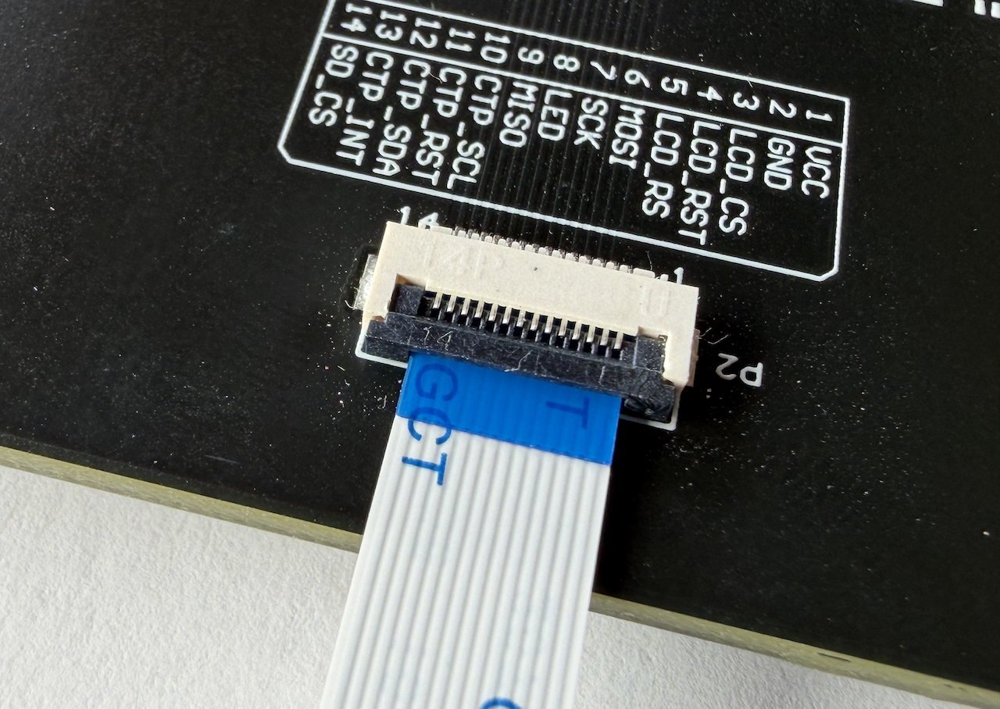
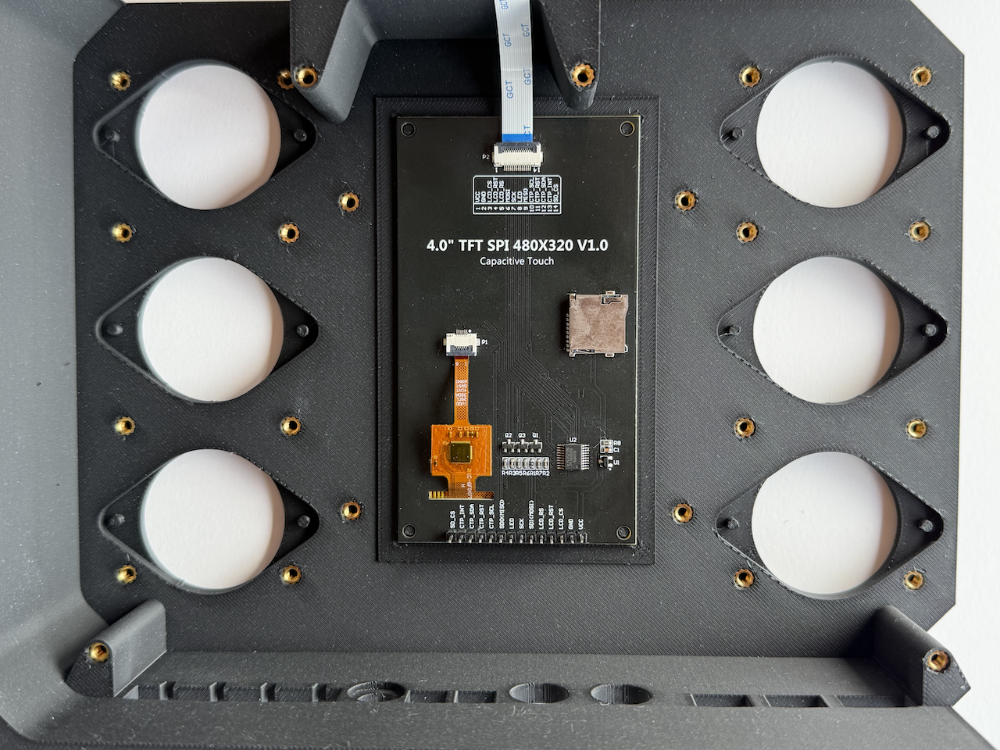
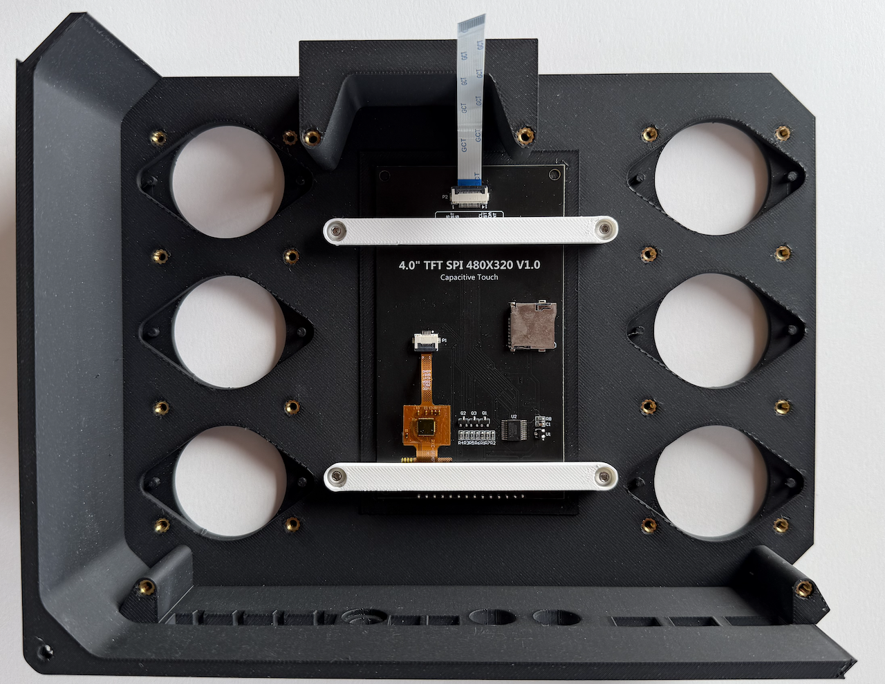
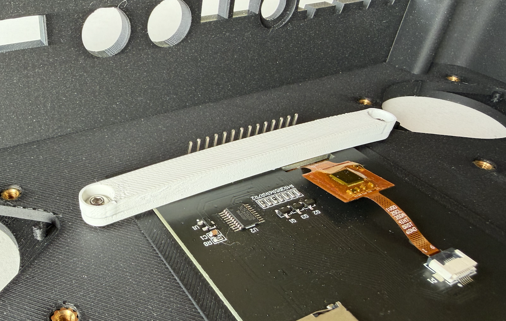
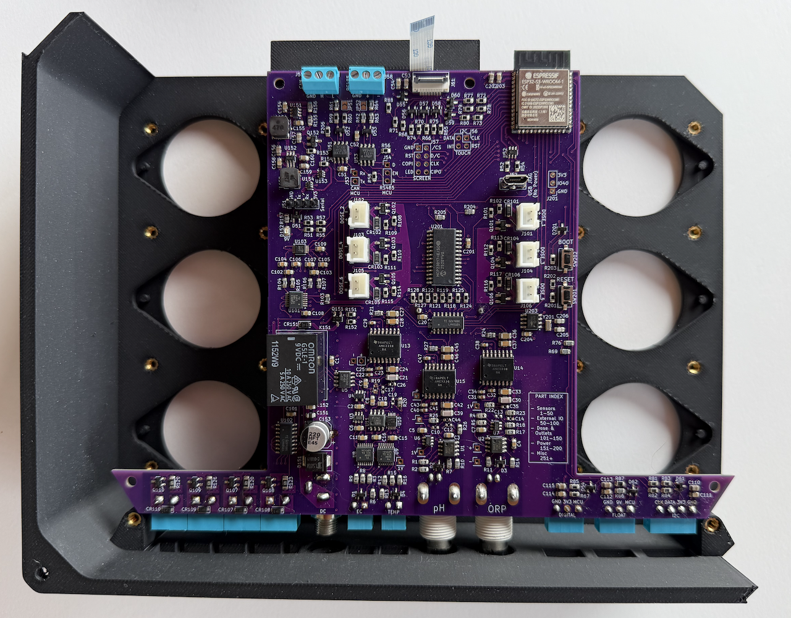
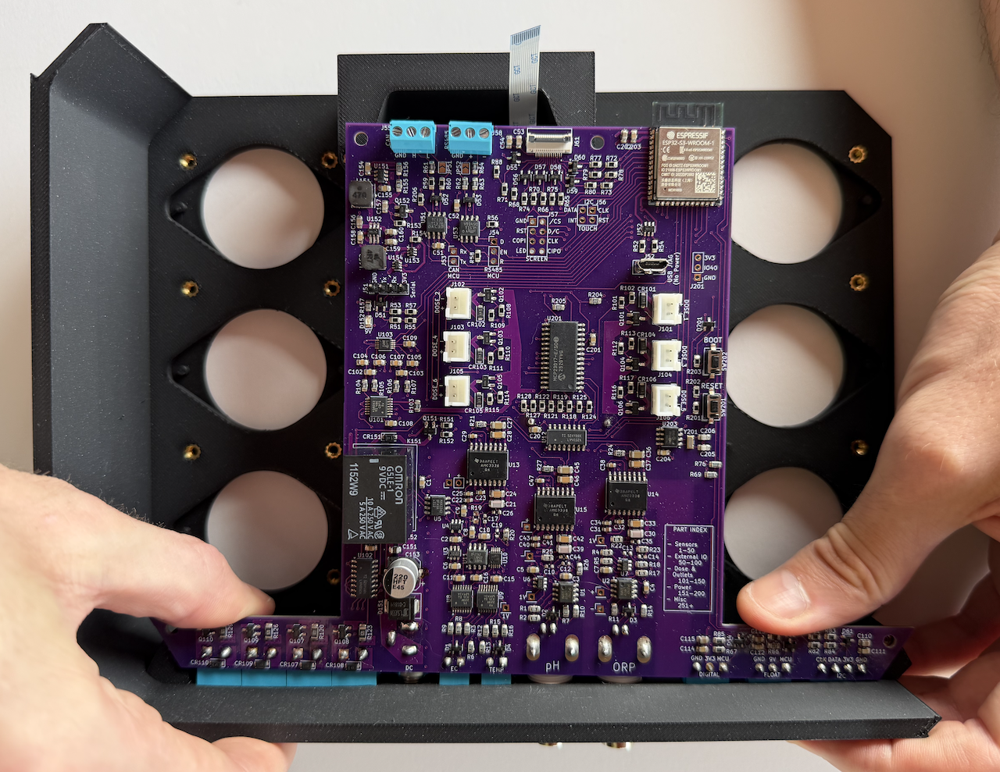
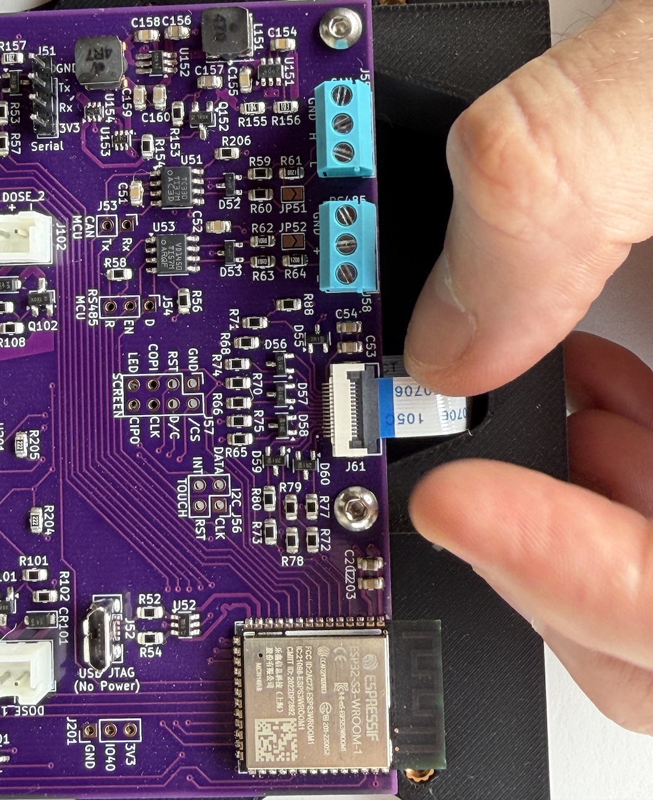
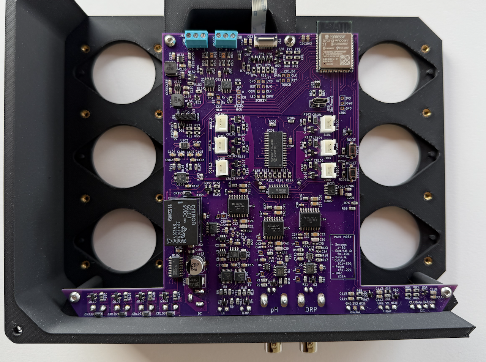
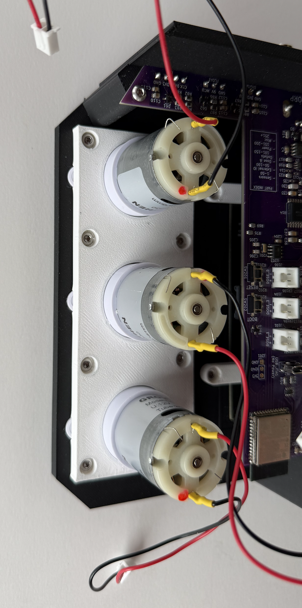
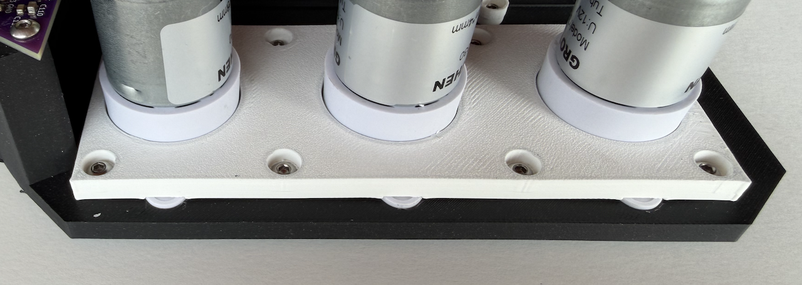

# Final Assembly
Now that you've printed the enclosure and assembled the PCB, you're ready to put everything together.

## Pre-Assembly
If you haven't flashed the firmware to the motherboard yet, it's recommended that you do so now.  This will let you confirm that the cable connection between the PCB and the screen is correct before proceeding with the rest of assembly.

## Assembly Steps

### 1. Install LCD Screen
- [ ] Connect the FFC cable to the LCD.  Ensure the cable is fully inserted and properly lined up prior to locking the connector.
- [ ] Position the 4.0" LCD screen in the front panel mounting hole, with the FFC connector pointing towards the top of the enclosure.
- [ ] Secure with 4 M3x6mm screws.
- [ ] Turn the enclosure around and confirm the screen is secured properly.  It should be sitting nicely in the enclosure and shouldn't have any give when pressed.

- { data-title="Screen with FFC cable inserted" }

- { data-title="Screen properly aligned in enclosure" }

- { data-title="Screen with retainers holding it in place" }

- { data-title="Close-up of a screen retainer screwed in place. A slight bend in the retainer is okay, you want the screen firmly held in place." } 

### 2. Install PCB
- [ ] Position the populated PCB in the enclosure, sliding the connectors into the bottom panel
- [ ] Connect the FFC cable from the LCD to the screen connector on the PCB
- [ ] Secure the PCB with 4 M3x6mm screws
- [ ] Now is an excellent time to turn the unit around and plug in the power supply.  Once the peristaltic pumps are installed, you can't remove the PCB without removing the pumps first.  If your screen cable is loose or misaligned, it's _way_ better to find that out now rather than after you've installed the pumps.

- { data-title="PCB laid flat in the enclosure" }

- { data-title="PCB external connectors being inserted into the enclosure's bottom wall" } 

- { data-title="The screen FFC inserted and locked into the PCB's connector.  Like with the screen, ensure the cable is fully inserted into the connector and properly aligned before locking the connector." }

- { data-title="PCB screwed into the enclosure, with the screen cable plugged in." }

### 3. Install Peristaltic Pumps
- [ ] Remove the front housings from the pumps if you haven't already.
- [ ] Insert 3 pumps into the mounting holes on the enclosure , and feed the JST pigtails through the holes of one pump mounting plate.
- [ ] Push the pump mounting plate down, until it's slid over the all 3 pumps, and secure with 8 M3x6mm screws.
- [ ] Repeat for the other 3 pumps.
- [ ] Connect the JST pigtail connectors to the corresponding terminal blocks on the PCB -- they match positionally, so the bottom-left pump should connect to the bottom-left terminal block, etc.

- { data-title="All 6 pumps with pigtail connectors attached and heads removed, ready for mounting into the enclosure" } 

- { data-title="3 pumps mounted on one side of the PCB" }

- { data-title="A close-up shot of a properly-mounted pump retaining plates.  The pumps will stick up above the enclosure wall about half a millimeter, and there will be a very small gap between the retaining plate and the inner wall of the enclosure." } 

- { data-title="All 6 peristaltic pumps mounted into the enclosure" }

### 4. Connect everything on the outside of the enclosure
- [ ] Turn the unit around and re-install the pump heads.  Going from top-to-bottom is slightly easier.
- [ ] Screw the included nuts onto the threads of the DC power jack and BNC jacks.

- { data-title="The front of the enclosure before pump heads are attached" }

- { data-title="The washers and nuts that come with the DC and BNC jacks, lined up with where they go" } 

- { data-title="The nuts once they're screwed on" }

- { data-title="All pump heads are securely reattached and the nuts for the DC/BNC jacks are screwed into place" } 

### 5. Initial Power-On Check

- [ ] Power on the system
- [ ] Verify LCD displays status screen
- [ ] Check for any error indications

## Next Steps
Proceed to the [Setup](setup.md) section for initial configuration and setup steps.
