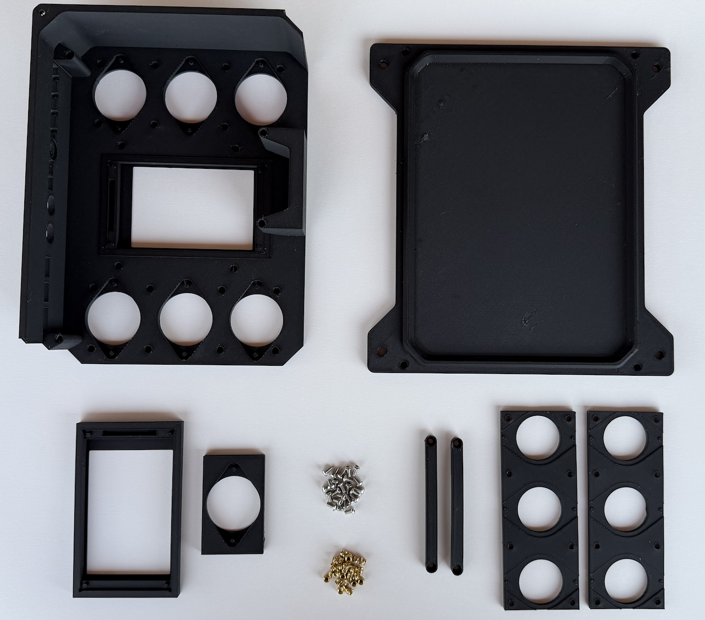
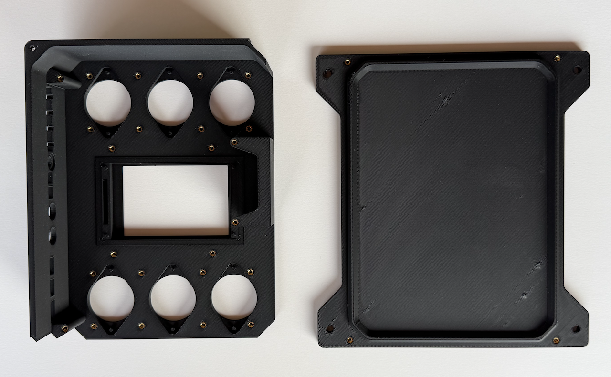
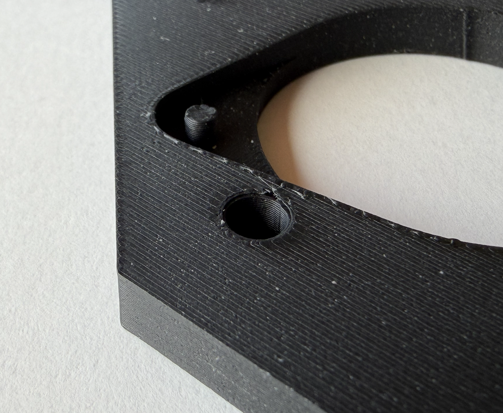
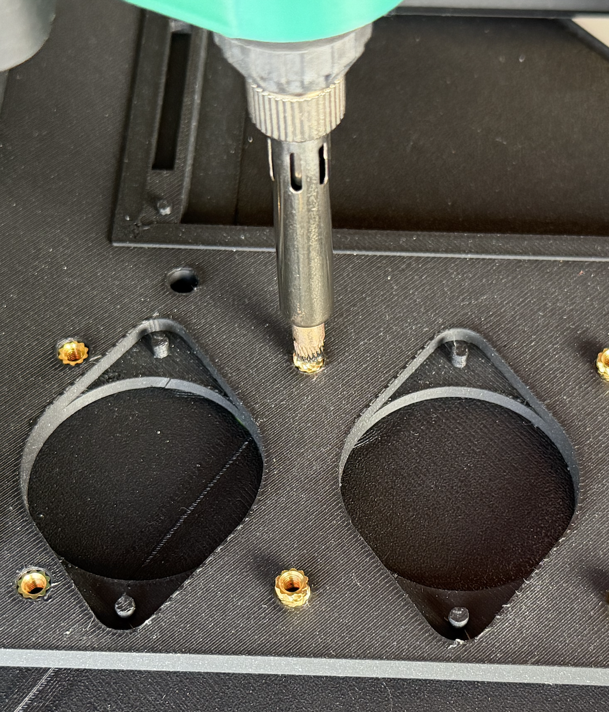
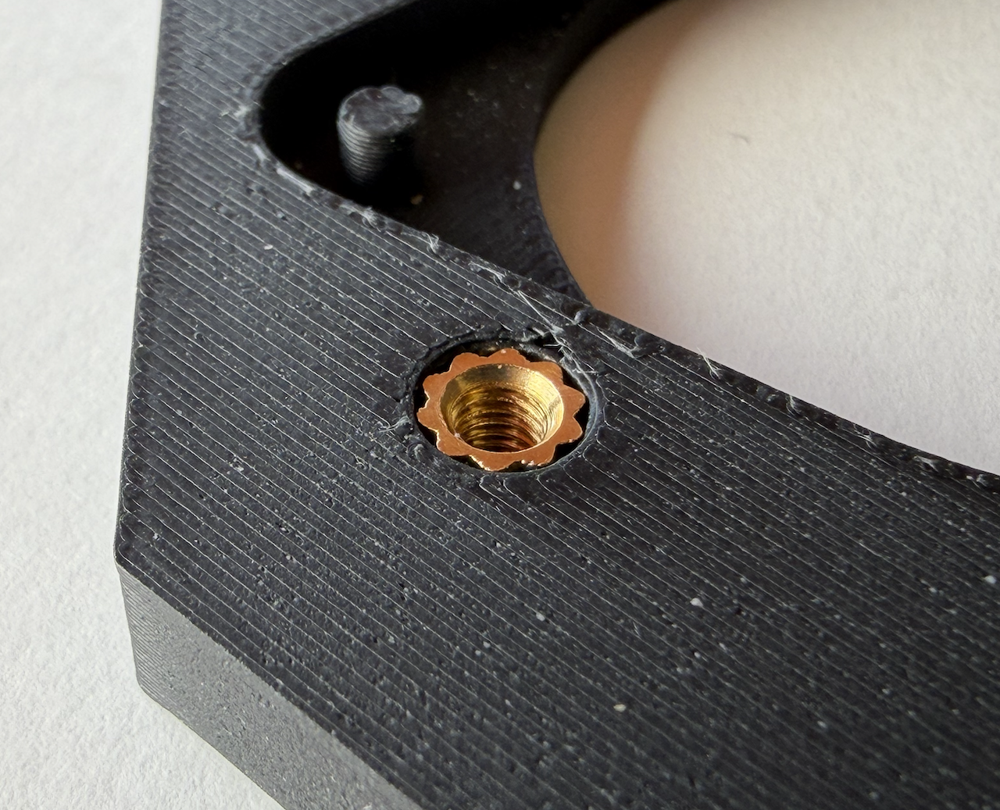
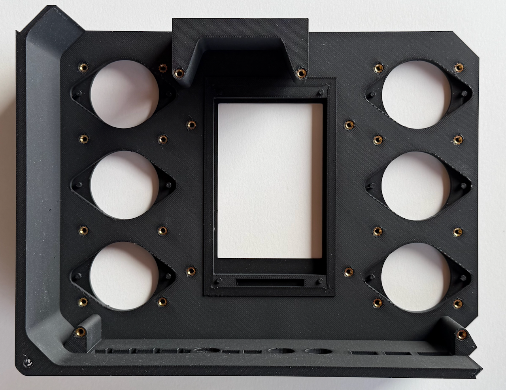

# Enclosure Assembly

This guide covers printing and assembling the 3D-printed enclosure.

## Before You Print

Before committing to printing the full enclosure, it's recommended to print the fit testers to verify compatibility with your specific printer calibration and parts:  

- [ ] Screen fit tester
- [ ] Pump fit tester

**Tip:** Use scarf seams if your slicer supports them.  Otherwise, you might need to trim seam bumps out of critical holes.

The screen and pump should fit snugly into these holders.  Adjust your print settings if you're not able to get a good fit with the fit testers.  Failing that, you can try tweaking some design parameters in FreeCAD to get a better fit.

## Parts to Print

- [ ] 1x Case body
- [ ] 1x Case back
- [ ] 2x Pump plates
- [ ] 2x Screen holders

  NOTE: the enclosure body shown in most of these assembly photos has 2 of its sides chopped off.  Additionally, in later assembly photos the pump plates and screen holders are printed in a white filament.  These are simply to make certain steps easier to see -- your enclosure body should have all 4 sides, and there's no need to use a different filament for internal printed parts when you're building this.

- { data-title="A heat-set insert ready for insertion" }

- { data-title="Enclosure body and lid once all heat-set inserts are in place" }

Tree supports work well for the connector holes on the bottom wall of the enclosure, as well as overhanging screw holes.  As with the fit testers, use scarf seams if you can.

## Heat-Set Insert Installation

After printing, install the M3x5x4 heat-set inserts:

- [ ] Heat soldering iron to appropriate temperature for the material you used
- [ ] Install 28x M3x5x4 heat-set inserts into designated holes

    - [ ] Enclosure Body: 24 inserts
    - [ ] Enclosure Back: 4 inserts

- { data-title="A heat-set insert ready for insertion" }

- { data-title="Mid-insertion, try to keep your soldering iron vertical, and apply only light pressure to it" } 

- { data-title="Heat set insert after insertion.  Sitting slightly below the surface is fine, but you don't want them sticking up out of the hole." }

- { data-title="All heat-set inserts successfully inserted into the enclosure body" }

**Tip:** Use an M3 heat-set insert tip if possible.  It makes for easier installation, plus it saves you from having to clean melted, burned plastic off of your soldering iron's tip.

## Fit Verification

Before proceeding to final assembly, verify the following fits:

- [ ] LCD screen fits properly in its mounting location
- [ ] Peristaltic pumps fit in their respective mounting holes
- [ ] Bare or populated PCB fits in case body
- [ ] All heat-set inserts are properly seated and threads are clear
- [ ] Enclosure back fits cleanly onto enclosure body, and the two halves screw together cleanly

## Next Steps

Once the enclosure is complete and fit-checked, proceed to [Final Assembly](assembly.md).
