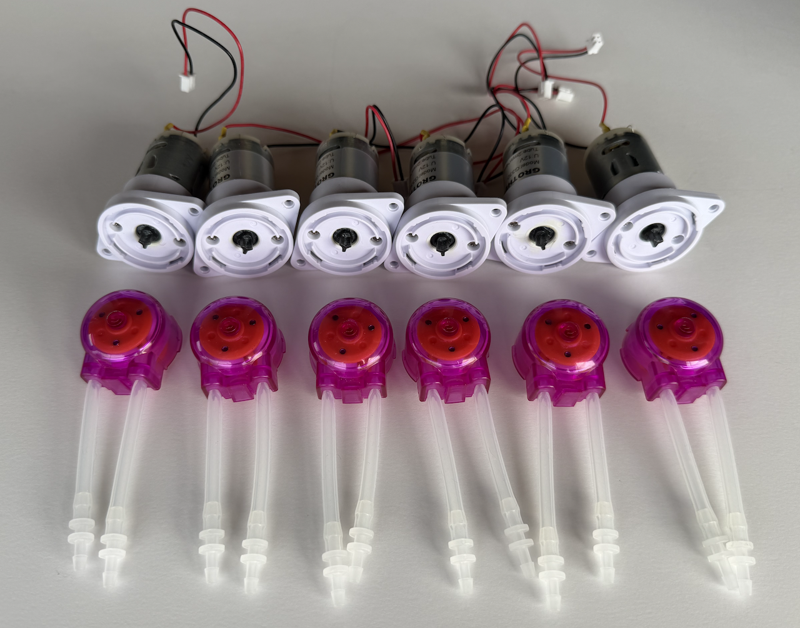
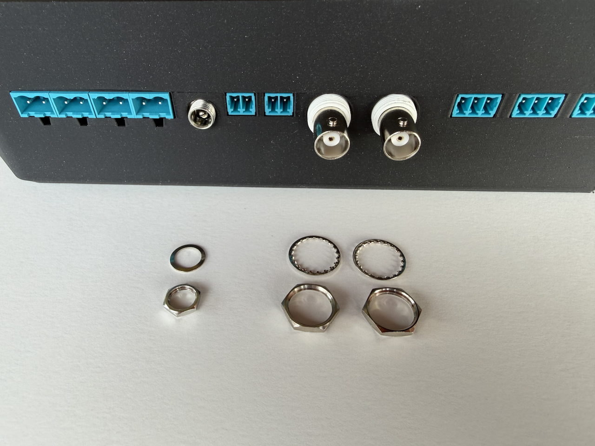
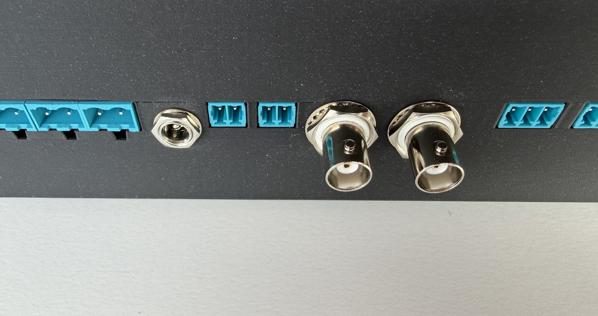
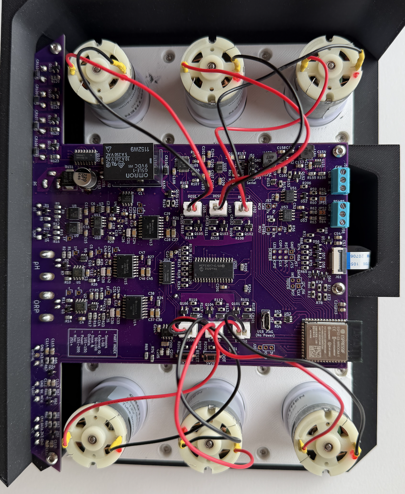
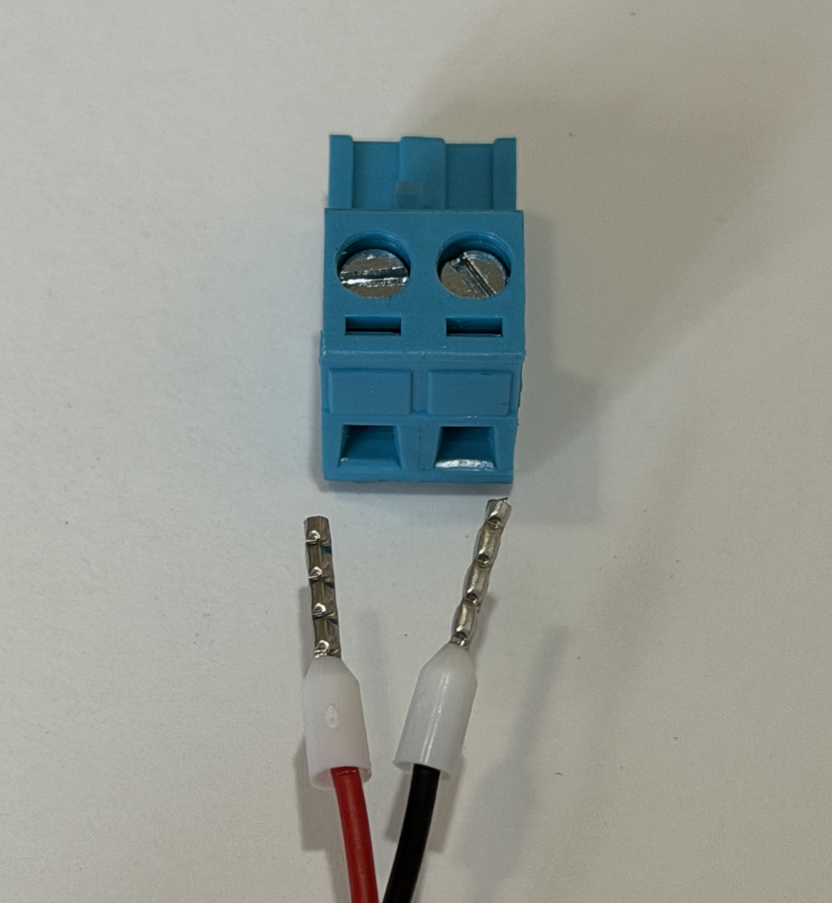
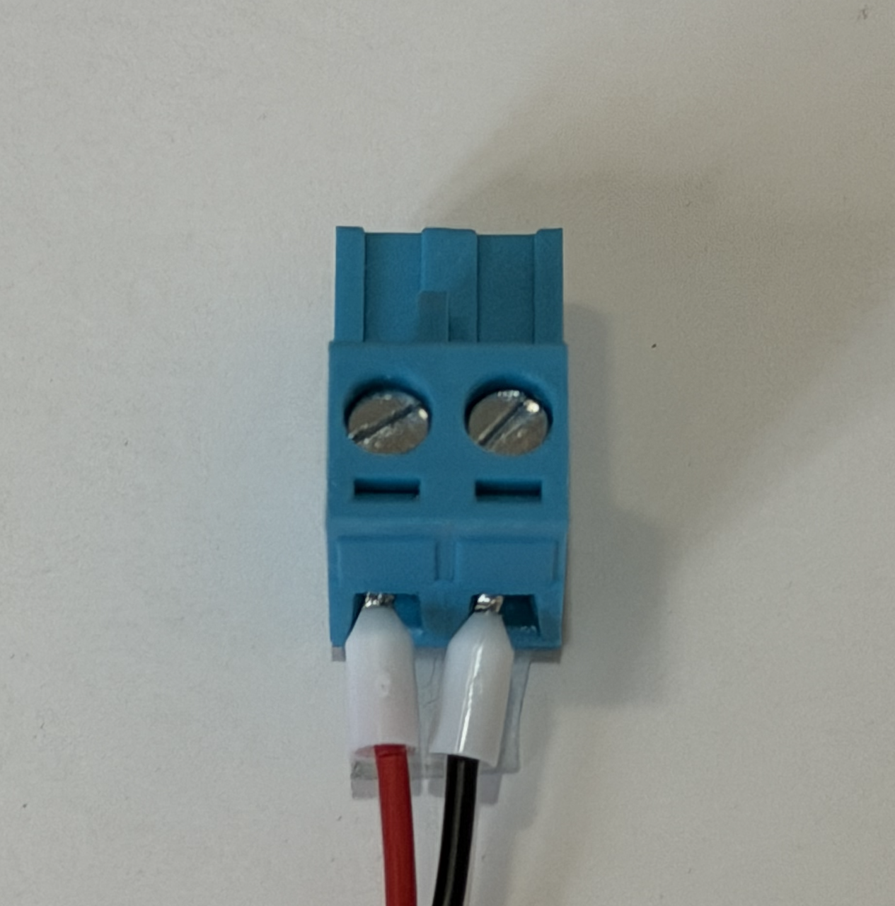
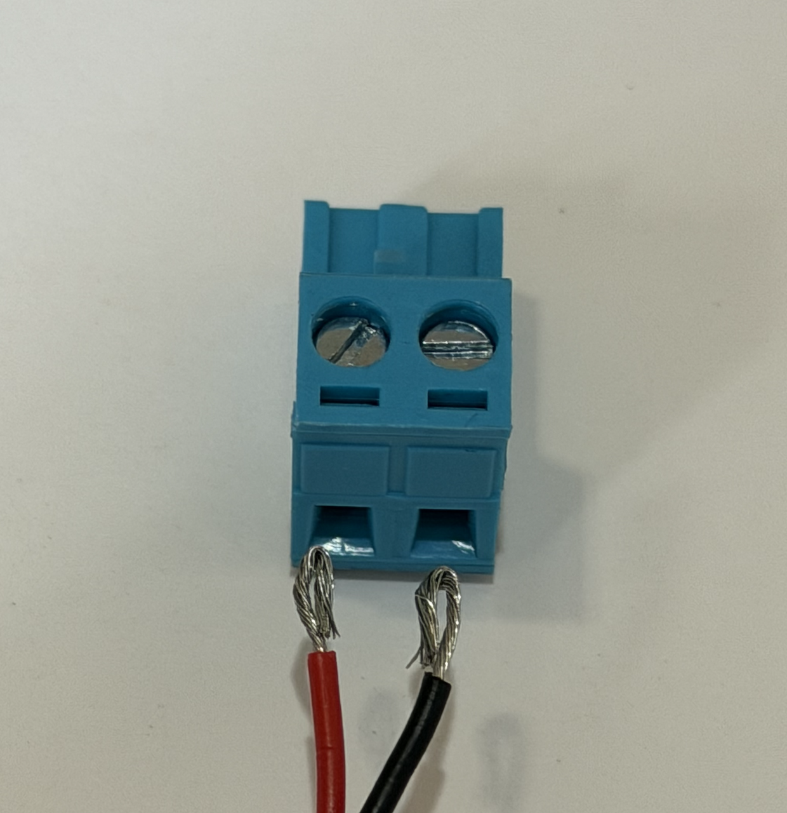
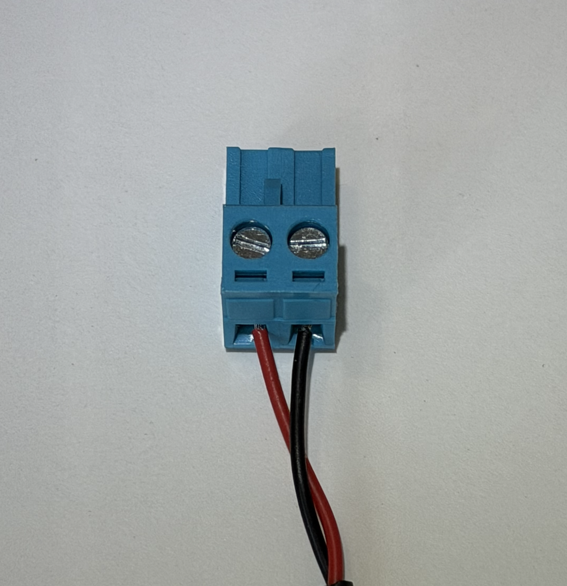
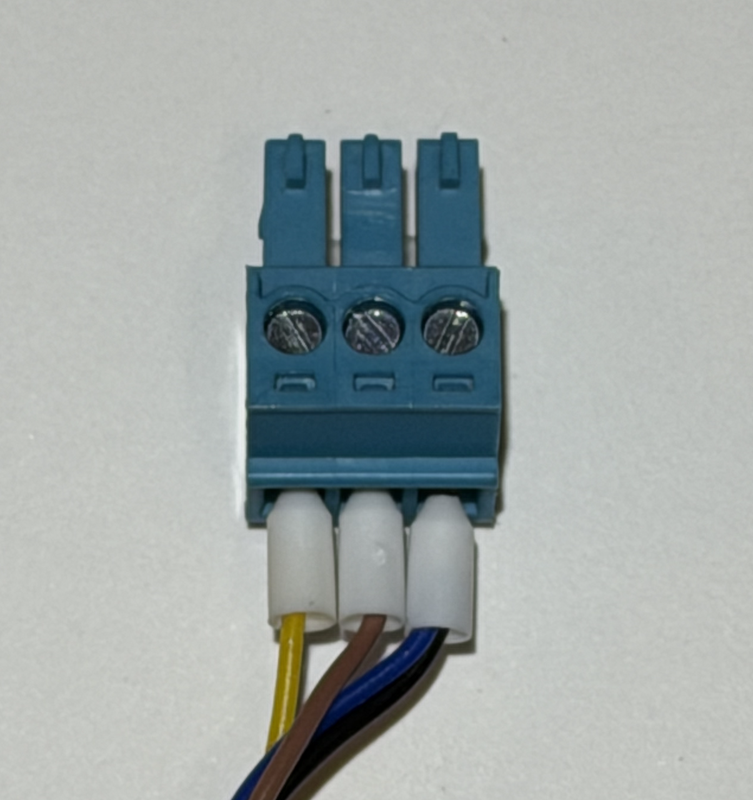

# Setup

Okay, so you've got everything assembled, the firmware is flashed, and it boots without errors.  Everything looks good.  Now what?

## Initial configuration
Tap on the "Config" tab when your unit boots up.  You'll see a few options:
 - [ ] Tank size: Input the size of your reservoir.  This is used to calculate treatment solution dosage volumes.
 - [ ] Display Units: Set the temperature and conductivity to your desired display units.  By default it uses Celsius and uS/cm.
 - [ ] Time: Set the appropriate date, time, and time zone for your location.

## Sensor Setup & Calibration
Once you've got the basic device configurations done, you'll need to set up and calibrate whatever sensors you're using.  

### Plug in Your Sensors
For starters, plug in all the sensors you're planning on using.  The enclosure doesn't have any visual indications on the exterior of which sensors go where, so their locations are listed below.

- pH: The BNC terminal on the right
- ORP: The BNC terminal on the left
- Conductivity: The 2-pin pluggable terminal to the immediate left of the DC power jack
- Temperature: The 2-pin pluggable terminal to the immediate right of the BNC jacks

Note: conductivity and temperature sensors don't care about polarity, so no need to worry about which wire goes where in the screw terminal.  Just make sure that everything is plugged into the right input jack.

- { data-title="The front of the enclosure before pump heads are attached" }

- { data-title="The washers and nuts that come with the DC and BNC jacks, lined up with where they go" } 

- { data-title="The nuts once they're screwed on" }

- { data-title="All pump heads are securely reattached and the nuts for the DC/BNC jacks are screwed into place" } 

### Sensor Software Setup
Once they're all plugged in, enable and calibrate all the sensors you'll be using.  To enable and begin using a sensor, click the sensor's display in the "Status" tab to enable it, and use the "Change Allowed Range" button to set the minimum and maximum acceptable values for the sensor.  Once Demetra registers a reading that falls outside of the acceptable range, it will automatically take corrective action if possible.  Besides enabling the sensor and setting the range, different sensors require different setup and calibration steps:

  - [ ] Temperature: Demetra uses a 10k NTC thermistor, and you'll need to configure the beta value for your thermistor*. Do this first, since both pH and EC are affected by temperature, so to get the most calibrations and measurements possible you'll need to be able to measure temperature.  
  - [ ] pH: Calibrate the sensor using calibration solutions of known pH (Note: For the moment only 3-point calibration is supported)
  - [ ] Conductivity: Calibrate the sensor using a calibration solution of known conductivity.
  - [ ] ORP: Calibrate the sensor using a calibration solution of known ORP.

* The beta value indicates how strongly the thermistor's resistance varies with temperature, and it's necessary to convert raw readings into a meaningful temperature measurement. The beta value should be available in the datasheet or listing for your thermistor -- Demetra works with any beta value, but it does need to know what that value is.

## Dosing Pump Calibration
Using inexpensive dosing pumps helps keep overall cost low, but the downside is that their flow rates can vary significantly from pump to pump.  But!  That variation can be accounted for to dial in the flow rate for a particular pump.  Calibrating your pumps lets Demetra take each pump's flow rate into account when calculating how long to run a pump to dose in a particular amount of treatment solution.  To calibrate a dosing pump, click the pump's icon in the "Pumps" tab, and use the "Calibrate" button to determine that particular pump's flow rate.  You'll need water and something to measure volume (or weight) precisely.  It's easiest to knock out all 6 pumps at the same time, then you don't need to worry about it again.

## Dosing Pump Setup
Demetra's dosing pumps are used to control your reservoir's pH, nutrient, and ORP levels.  They're automatically triggered when sensors detect measurements outside your acceptable range.  Demetra supports up to 6 dosing pumps, which can be configured with the following options:
  - pH Down: Added whenever your reservoir's pH needs to lowered
  - pH Up: Added whenever your reservoir's pH needs to be raised
  - Nutrients: Added whenever your reservoir's nutrient levels fall outside your configured range*
  - ORP Treatment: Added whenever your reservoir's ORP levels drop

To set up a dosing pump, click the pump's icon in the "Pumps" tab, and do the following:
  - Configure the treatment solution you're using, and the solution strength if you have it -- if not, you can measure the solution strength using the "One-off Measurement" function of the appropriate sensor, with the caveat that you may need to dilute the treatment solution to get an accurate reading.
  - (Optional) Rename the pump to something more descriptive

*Right now, Demetra only supports using a single nutrient solution.  There's a roadmap item for supporting multiple nutrient solutions, mixing ratios, and scheduled ratio changes.  However, at the moment, you'll need to pre-mix them together into a single solution.

## Outlet Setup

**CAUTION: Outlets can source a maximum current of 3A**
This amperage can be distributed among outlets however you want.  Right now, software support for current monitoring and automatic shutoff isn't fully implemented, so it's up to you to make sure your outlets' loads don't exceed 3A combined.  If you need to drive a larger load than that, you can set up an external relay and hook it up to an outlet.

### Wire up an Outlet
To wire up an outlet, prep your wires for the screw terminal (either by crimping or by twisting and U-bending them), and then connect them to the terminal plug as shown below.  Red (left) is VCC, black (right) is GND.  Once you've tightened the screws to hold the wires in place, give them a gentle tug to make sure they're locked in place.

- { data-title="The front of the enclosure before pump heads are attached" }

- { data-title="Crimped outlet wires locked" } 

- { data-title="Stranded outlet wires twisted together and bent into a U shape" }

- { data-title="Twisted and U-bent outlet wires locked in the screw terminal." }

### Outlet Software Setup

To set up an outlet, click the outlet's icon in the "Outlets" tab.  Demetra supports up to 4 DC outlets, which can be used for any of the following:
  - Fertigation pumps: These run on whatever schedule you configure.
  - Solenoid valves: If you have a water line feeding your reservoir, demetra supports automatic top-up of your reservoir from the water line once the float switch is activated.
  - Stir pumps: Sits inside your reservoir, triggered to run after a treatment solution is added.  They're not strictly necessary, but they will make your dosing feedback loop much tighter, since they'll disperse treatment solutions evenly throughout your reservoir.
  - General-purpose outlets: This is a catchall category for anything besides a fertigation pump that you want to control.  They're scheduled exactly like fertigation pumps.

## Float Switch Wiring

Demetra expects your float switch to send a high voltage when the water level is low.  So, if you're using a mechanical float switch, it needs to be a normally-closed switch.  If you're using a capacitive float switch like the XKC-Y25-V, you need to ensure that its output is high when the water level is low.  The below image is the wiring for the XKC-Y25-V capacitive float switch: yellow is output, brown is VCC, and blue is GND.  In this case, the black wire (MODE) crimped to GND, so that the switch output goes high when it detects a low water level.

- { data-title="Capacitive float switch wired up.  Yellow for output, brown for VCC, and blue for GND (black also tied to GND for this specific model).  If using a 2-wire mechanical float switch, connect the two wires to the Output and VCC terminals, omitting GND." }

