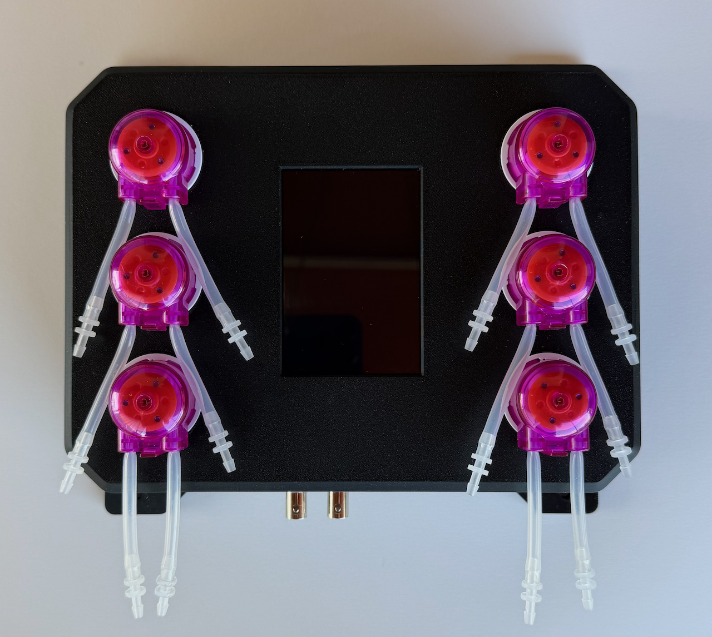

# Demetra

You got into hydroponics because you care about what you're growing, not because you're passionate about pH and TDS levels.  Demetra takes care of that for you, freeing you up to focus on what's important: your plants.

Demetra is a low-cost, local-first, subscription-free hydroponic garden controller.
It provides hassle-free management of your system's pH, nutrient, and ORP levels.  Additionally, it can drive watering schedules and automatically top up your reservoir from a water line or external tank.
Demetra is built almost exclusively with off-the-shelf parts and components.  The parts that _are_ custom are explicitly designed to be fabricated as easily as possible:

- Motherboard:  Designed to be hand-populated, with primarily 0805 passives and SOIC-package ICs.  Any circuit board manufacturer should be able to fabricate the bare PCB, and you can populate it yourself.
- Enclosure:  240mm x 210mm x 65mm, which fits many consumer 3D printers.

- { data-title="Demetra fully assembled.  Visible are the 6 peristaltic dosing pumps and screen.  Not pictured: sensor inputs" }

## What it does

Demetra continuously monitors your system's pH, nutrient, and ORP levels, and adjusts them as needed to maintain optimal growth conditions.

Additionally, the system has 4 configurable DC outlets, which can be used for the following:

- Fertigation pumps, which run on a user-defined schedule
- Stir pumps, which are triggered to run after a treatment solution is added (e.g. pH down or nutrients), mixing your reservoir to ensure a tight feedback loop
- Solenoid valves, which can be used in conjunction with the water-level sensor to top up your reservoir from a water line
- General-purpose outlets, which are scheduled like fertigation pumps

Its local-first UI means that you can configure it using the onboard screen, no need for a subscription.

## What it doesn't do

Demetra's primary focus is reservoir control and fertigation management.  It does not try to do:

  - Plant health monitoring: It should free you up to pay more attention to your plants, but it won't do that for you.
  - Lighting, humidity, or other environmental control.  You could theoretically get by using general-purpose outlets and an external relay, but that's out of Demetra's wheelhouse.
  - Reservoir temperature control: Demetra does monitor your reservoir's temperature, but it uses that information to control your reservoir's pH and nutrient levels.

## Building it

For more information on how to build this project, see the [build guide](build_guide/what_you_need.md).
Outside of PCB assembly and enclosure printing time, assembly and initial setup should take a few hours.

## Cost

It costs about $400 to build, excluding sensors.

- Motherboard: $230: $100 shipped for fabrication of the bare PCB from JLCPCB, $130 for components from digikey (other suppliers might charge different prices).
- Enclosure: 500g of your chosen filament (call it $10), and heat-set inserts (~$10 for a set on Amazon, less from AliExpress)
- Peristaltic pumps: $80 shipped for 6 off of AliExpress, and JST pigtails are cheap if you throw in that order as well.
- Screen: $20 from either Amazon or AliExpress
- Sensors: Budget-dependent, on the low end you're looking at $20 for a pH probe, $20 for a conductivity probe, $30 for an ORP probe, and $5 for a 10k NTC thermistor.

Links to specific parts can be found in [What You Need](build_guide/what_you_need.md#part-purchase-links).

## Roadmap:
There are some features that currently have hardware support, but aren't handled yet on the software side:

- [ ] Plumb the external Digital I/O pin through in software to allow monitoring of an external flood sensor.  
- [ ] External I2C integration to ingest data from miscellaneous sensors.  The hardware configuration has been confirmed to work, but there isn't currently software support for using it.
- [ ] WiFi and MQTT support.  The ESP32 hardware supports this, but it's not yet built out.  This would allow for remote configuration and monitoring, as well as the ability to set up healthchecks, dashboards, and notifications on warnings and errors.
- [ ] Support for multiple treatment solutions of the same type, .
- [ ] The CAN and RS485 hardware is currently totally untested.